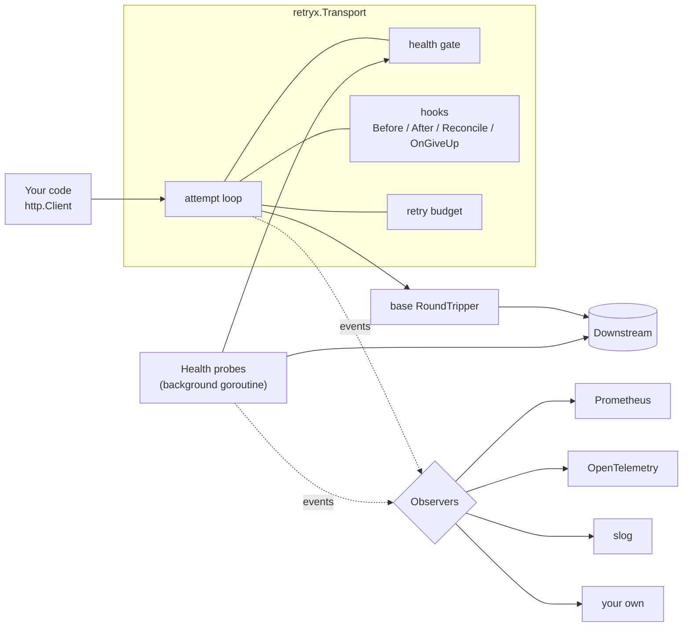
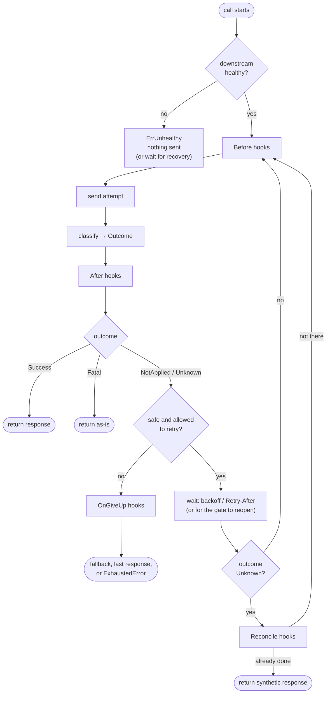
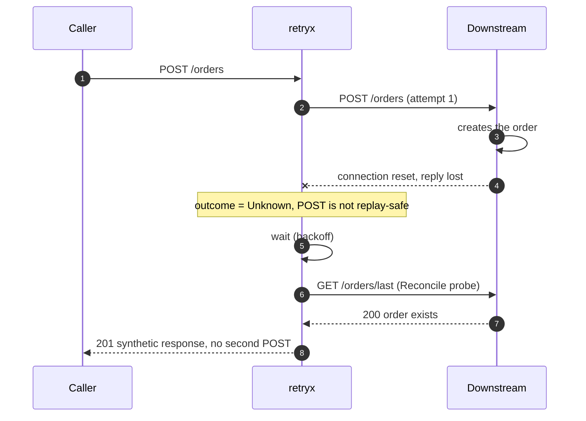
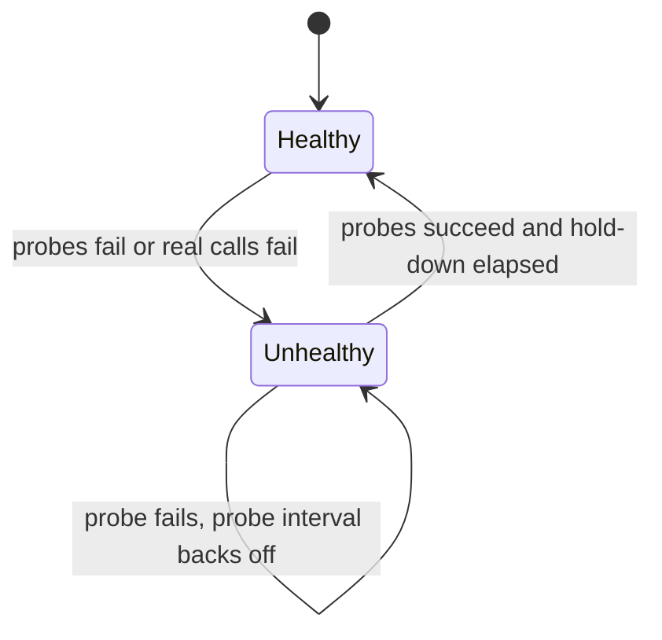

# retryx

**HTTP retries that know the difference between "it didn't happen" and "I don't know if it happened".**

A retrying `http.RoundTripper` for Go that:

- never blindly re-sends a request that may already have been processed,
- stops sending traffic to a downstream that is down (and lets it recover),
- lets you plug in *any* logic before, between and after attempts with one hook type,
- emits events you can turn into Prometheus, OpenTelemetry, logs, or anything else.

Go 1.21+ · the core module has **zero third-party dependencies** · works with any
code that accepts an `*http.Client`.

> The module path `github.com/abdussalamfaqih/retryx` is a placeholder. Change it in `go.mod`
> (and in the imports of `examples/` and `obs/`) to your repository path.

## Contents

- [Why](#why)
- [Features](#features)
- [Quick start](#quick-start)
- [Core concepts](#core-concepts)
- [Architecture](#architecture)
- [Use cases and examples](#use-cases-and-examples)
- [Health gating](#health-gating)
- [Observability](#observability)
- [Configuration reference](#configuration-reference)
- [Built-in hooks](#built-in-hooks)
- [Guarantees and limits](#guarantees-and-limits)
- [How it relates to other libraries](#how-it-relates-to-other-libraries)
- [Project layout](#project-layout)
- [Development](#development)
- [Roadmap](#roadmap)

## Why

Most retry libraries answer one question after a failure: *retry or not, and
when?* Real systems need more:

| Problem | What usually happens | What retryx does |
|---|---|---|
| A `POST` times out. Did the payment go through? | It is retried and the customer is charged twice. | Classifies the failure as **Unknown**. Retries only if the call has an idempotency key or a *reconcile probe* confirms it did not happen; otherwise fails closed. |
| The API supports no idempotency key | You cannot retry safely at all. | **Reconcile before retry:** ask the downstream (`GET`) whether the resource already exists and return it instead of re-sending. |
| A downstream is down | Every caller runs its own retry loop against a dead service; the outage gets longer. | A **health gate** (active probes plus passive feedback) stops traffic, waiters are released with jitter on recovery, and a shared **retry budget** caps amplification. |
| A retry needs fresh state | Custom wrapper code around every call site. | **Hooks**: new idempotency key, refreshed token, another region, a re-signed request. |
| "Is our retry layer helping or hurting?" | No idea. | Metrics for attempts, outcomes, waits, gate rejections, probes, and give-up reasons. |

## Features

| | |
|---|---|
| **Three-valued outcomes** | `Success`, `NotApplied` (safe to retry), `Unknown` (may have been applied), `Fatal` |
| **Fail-closed safety gate** | Unknown + non-idempotent + no key/probe ⇒ no blind resend (`ErrUnsafeToRetry`) |
| **Idempotency keys** | Stable per call (safe replay) or fresh per attempt |
| **Reconcile-before-retry** | A check function can stop the retry and return the already-created resource |
| **Hook phases** | `Before`, `After`, `Reconcile`, `OnGiveUp`, all the same `Hook` signature |
| **Health gating** | Active probes with exponential probe backoff, passive failure counting, fail-fast or wait-for-recovery, jittered release |
| **Retry budget** | Shared token bucket that caps retries during an outage |
| **`Retry-After`** | Honoured (seconds or HTTP date) with a configurable maximum |
| **Backoff** | Exponential with equal jitter, replaceable |
| **Per-attempt timeout** | Covers only the network round trip |
| **Body replay** | Uses `GetBody`, or buffers up to a limit |
| **Observability** | Tool-agnostic `Observer`; adapters for Prometheus, OpenTelemetry (metrics and spans), `slog` |

## Quick start

```bash
go get github.com/abdussalamfaqih/retryx
```

```go
package main

import (
	"log"
	"net/http"
	"strings"
	"time"

	"github.com/abdussalamfaqih/retryx"
)

func main() {
	client := &http.Client{
		Transport: retryx.New(nil, // nil = http.DefaultTransport
			retryx.WithMaxAttempts(5),
			retryx.WithAttemptTimeout(3*time.Second),
			// One key per logical call, reused by every retry. Also marks the call
			// replay-safe, so even a timeout on this POST may be retried.
			retryx.Before(retryx.IdempotencyKey("Idempotency-Key", retryx.RandomKey, retryx.KeyPerCall)),
		),
	}

	resp, err := client.Post("https://api.example.com/payments", "application/json",
		strings.NewReader(`{"amount":100}`))
	if err != nil {
		log.Fatal(err) // errors.Is(err, retryx.ErrUnsafeToRetry) etc. work
	}
	defer resp.Body.Close()
}
```

Try it without any setup: `go run ./examples/basic`.

## Core concepts

### Outcomes

Every attempt is classified into one of four outcomes:

| Outcome | Meaning | Default triggers | Retried? |
|---|---|---|---|
| `Success` | done | status < 400 | no, returned |
| `NotApplied` | the server did **not** process it | dial error, DNS failure, `408` `425` `429` `503` | yes |
| `Unknown` | the server **may** have processed it | timeout, connection reset, EOF, `500` `502` `504` | only if replay-safe or reconciled |
| `Fatal` | will never succeed | other `4xx`, `501` `505`, TLS verification error, caller cancelled | no, returned as-is |

The classifier is replaceable (`WithClassifier`) and `After` hooks can override it
per attempt.

### Replay safety

A request is *replay-safe* when sending it twice cannot create a second side effect:
`GET` `HEAD` `OPTIONS` `TRACE` `PUT` `DELETE`, or any call for which a hook set
`Call.Idempotent` (the `IdempotencyKey` hook does this for `KeyPerCall`).

| Situation | Behaviour |
|---|---|
| `NotApplied` | retry |
| `Unknown` and replay-safe | retry |
| `Unknown`, not replay-safe, a `Reconcile` hook exists | run the probe first; retry only if it says "not there" |
| `Unknown`, not replay-safe, nothing else | **give up** (`ErrUnsafeToRetry`) |

### Hooks

One signature serves every extension point:

```go
type Hook func(ctx context.Context, a *retryx.Attempt) retryx.Verdict
```

A hook returns `Continue()` (do nothing), `Succeed(resp)` (stop and return `resp`) or
`Fail(err)` (stop and return `err`).

| Phase | Runs | Typical use |
|---|---|---|
| `Before` | before every attempt, including the first | idempotency key, auth header, signing, failover host |
| `After` | after classification | inspect the body, override the outcome, trigger a token refresh |
| `Reconcile` | between attempts, only after an `Unknown` outcome | "did it already happen?" probe |
| `OnGiveUp` | once, when retrying stops without success | fallback response, park in an outbox, compensation |

`Attempt` gives hooks the per-attempt request clone (`a.Req`, safe to mutate), the
response/error, the outcome, the attempt number, and the per-call state
(`a.Call.History`, `a.Call.Set` / `retryx.Value[T]`).

## Architecture



### One call, step by step



### Example: the reply was lost



Full design notes, ordering rationale, concurrency model and a safety matrix:
**[docs/ARCHITECTURE.md](docs/ARCHITECTURE.md)**.

## Use cases and examples

Every example runs offline against its own fake downstream:
`go run ./examples/<name>`. Details and expected output: [examples/README.md](examples/README.md).

| Use case | Example |
|---|---|
| Smallest useful setup, `Retry-After` | [`basic`](examples/basic/main.go) |
| Safe `POST` retries with an idempotency key | [`idempotency`](examples/idempotency/main.go) |
| Safe `POST` retries **without** server idempotency support (check first) | [`reconcile`](examples/reconcile/main.go) |
| Cap retry amplification with a shared budget | [`budget`](examples/budget/main.go) |
| Stop calling a service that is down, recover without a stampede | [`healthgate`](examples/healthgate/main.go) |
| Queue requests during an outage and replay them later | [`outbox`](examples/outbox/main.go) |
| Retry on `200` responses that carry an error payload | [`bodyretry`](examples/bodyretry/main.go) |
| Fail over to another region on retry | [`failover`](examples/failover/main.go) |
| Refresh an expired token and retry once | [`tokenrefresh`](examples/tokenrefresh/main.go) |
| Prometheus metrics for Grafana, plus logs | [`prometheus`](examples/prometheus/main.go) |

### Two patterns worth showing inline

**Check before retrying** (the downstream has no idempotency support):

```go
probe := func(ctx context.Context, a *retryx.Attempt) (*http.Response, error) {
	resp, err := plainClient.Get(orderURL) // a client WITHOUT the retry transport
	if err != nil {
		return nil, err // cannot tell: abort rather than risk a duplicate
	}
	defer resp.Body.Close()
	if resp.StatusCode == http.StatusOK {
		return retryx.NewResponse(a.Call.Original, http.StatusCreated, nil, []byte(`{"reconciled":true}`)), nil
	}
	return nil, nil // definitely not there: retry
}

client := &http.Client{Transport: retryx.New(nil,
	retryx.Reconcile(retryx.Reconciler(probe, false)), // false = fail closed if the probe is inconclusive
)}
```

**Park the request instead of failing it** while the downstream is down:

```go
retryx.OnGiveUp(func(ctx context.Context, a *retryx.Attempt) retryx.Verdict {
	if !errors.Is(a.Reason, retryx.ErrUnhealthy) {
		return retryx.Continue()
	}
	if err := outbox.Enqueue(ctx, a.Call.Original); err != nil { // serialize from the ORIGINAL request
		return retryx.Fail(err)
	}
	return retryx.Succeed(retryx.NewResponse(a.Call.Original, http.StatusAccepted, nil, []byte(`{"queued":true}`)))
})
```

## Health gating



```go
health, _ := retryx.NewHealth(retryx.HealthConfig{
	Check:            retryx.HTTPCheck(plainClient, "https://payments.example.com/health"),
	Labels:           retryx.Labels{Target: "payments.example.com"},
	PassiveThreshold: 5, // also trip after 5 consecutive failed real calls
})
health.Start(ctx)

client := &http.Client{Transport: retryx.New(nil,
	retryx.WithHealth(health, retryx.GatePolicy{
		StartWait: 0,               // new calls fail fast while down
		RetryWait: 30 * time.Second, // calls already retrying wait for recovery
	}),
)}
```

| While the downstream is down | Effect |
|---|---|
| New call | rejected immediately with `ErrUnhealthy`, nothing sent (or waits up to `StartWait`) |
| Call already retrying | does not sleep-and-hammer; waits for the "healthy again" signal (`RetryWait`) |
| Probes | back off exponentially, so the health check does not bombard it either |
| Recovery | waiting calls are released over a random `ReleaseJitter`, not all at once |

`HealthGate` is a two-method interface, so a circuit breaker or a service-mesh
signal can replace `Health`. Tuning, alerts and recipes: **[docs/HEALTH.md](docs/HEALTH.md)**.

## Observability

The engine emits plain `Event` values. Inject any number of observers:

```go
prom := promobs.MustNew(promobs.Options{})
client := &http.Client{Transport: retryx.New(nil,
	retryx.WithObserver(prom, slogobs.New(slog.Default())), // any mix, panic-safe fan-out
)}
ctx = retryx.WithOperation(ctx, "create_order") // becomes the `operation` label
```

| Adapter | Output | Module |
|---|---|---|
| [`obs/promobs`](obs/promobs) | Prometheus metrics | own `go.mod` |
| [`obs/otelobs`](obs/otelobs) | OpenTelemetry metrics and one span per attempt | own `go.mod` |
| [`obs/slogobs`](obs/slogobs) | structured logs, quiet on healthy traffic | core module |
| `retryx.Recorder` | in-memory events for tests | core module |

Key Prometheus series:

| Metric | Answers |
|---|---|
| `retryx_calls_total{result}` | how do calls end? (`success`, `reconciled`, `exhausted`, `unsafe_to_retry`, `downstream_unhealthy`, ...) |
| `retryx_attempts_total{outcome,status_class,error_class}` | why do attempts fail? |
| `retryx_call_duration_seconds` vs `retryx_attempt_duration_seconds` | latency users see vs a single try |
| `retryx_retry_wait_seconds{source}` | time spent waiting (`backoff` or `retry_after`) |
| `retryx_downstream_unhealthy`, `retryx_probe_total`, `retryx_health_transitions_total` | outages, probe health, flapping |
| `retryx_gate_events_total`, `retryx_budget_tokens` | calls blocked by the gate, retry budget left |

Write your own observer with one method:

```go
type Observer interface {
	Observe(ctx context.Context, e retryx.Event)
}
```

The full metric catalogue, PromQL panels and alert rules are in
**[docs/OBSERVABILITY.md](docs/OBSERVABILITY.md)**.

## Configuration reference

```go
retryx.New(base http.RoundTripper, opts ...retryx.Option) *retryx.Transport
retryx.NewClient(opts ...retryx.Option) *http.Client
```

| Option | Default | Purpose |
|---|---|---|
| `WithMaxAttempts(n)` | 4 | total attempts including the first |
| `WithBackoff(b)` | `ExponentialJitter(100ms, 5s)` | delay between attempts |
| `WithClassifier(f)` | `DefaultClassify` | map an attempt to an `Outcome` |
| `WithAttemptTimeout(d)` | none | timeout of one network round trip |
| `WithMaxRetryAfter(d)` | 30s | give up if the server asks for a longer wait |
| `WithBudget(b)` | none | shared retry budget (`NewBudget(max, refillPerSuccess)`) |
| `WithBodyBuffer(n)` | 1 MiB | buffer bodies without `GetBody`; `0` disables (sent once) |
| `WithHealth(gate, policy)` | none | gate every call on a `HealthGate` |
| `WithHealthSelector(sel, policy)` | none | pick the gate per request (`HealthByHost`) |
| `WithObserver(o...)` | none | inject observers (repeatable) |
| `WithLabeler(f)` | host + `WithOperation` | metric labels per request |
| `Before(h...)` `After(h...)` `Reconcile(h...)` `OnGiveUp(h...)` | none | hook phases |

Errors you can test with `errors.Is`: `ErrUnsafeToRetry`, `ErrRetriesExhausted`,
`ErrUnhealthy`, `ErrBudgetExhausted`, `ErrRetryAfterTooLong`, `ErrBodyNotReplayable`,
`ErrBodyTooLarge`. Transport-level give-ups return `*retryx.ExhaustedError` with the
attempt history; status-level give-ups return the last response, like `net/http`.

## Built-in hooks

| Hook | Phase | What it does |
|---|---|---|
| `IdempotencyKey(header, gen, scope)` | Before | sets a key; `KeyPerCall` reuses it on every retry and marks the call replay-safe, `KeyPerAttempt` generates a new one each time |
| `RandomKey()` | | UUIDv4 generator for the above |
| `Reconciler(probe, failOpen)` | Reconcile | wraps a `Probe` (found / not found / inconclusive) |
| `NewResponse(req, status, header, body)` | | builds a synthetic `*http.Response` for probes and fallbacks |
| `AttemptHeader(name)` | Before | sends the attempt number downstream |
| `FailoverHosts(hosts...)` | Before | attempt *n* goes to `hosts[(n-1) % len]` |
| `RetryOnBody(limit, classify)` | After | override the outcome based on the response body |
| `PeekBody(resp, limit)` | | read the start of a body and put it back |

## Guarantees and limits

**Guarantees**

- The caller's `*http.Request` is never mutated; hooks work on a per-attempt clone.
- A request that may already have been processed is not re-sent unless the call is
  replay-safe or a reconcile probe confirmed it was not applied.
- `EventCallStart` is always followed by exactly one `EventCallDone`, even if a hook
  panics.
- A misbehaving `Observer` cannot break a request or starve other observers.
- Cancelling the request context stops waiting immediately (backoff, health waits).

**Limits**

- Health and the retry budget are **per process**; instances do not share state.
- Reconcile is best effort: without server-side idempotency, a write still in flight
  can commit after a probe says "not found". A key or a unique constraint is the real
  fix.
- `Health` needs an active check; it is not a passive-only circuit breaker (plug one in
  via `HealthGate`).
- A response that the engine has decided to retry is not available afterwards, so
  gate-related give-ups after a status failure return an `ExhaustedError`.

More in [docs/ARCHITECTURE.md](docs/ARCHITECTURE.md#known-limitations).

## How it relates to other libraries

Based on their public documentation; check the projects for current details.

| Library | Good at | Where retryx differs |
|---|---|---|
| [hashicorp/go-retryablehttp](https://github.com/hashicorp/go-retryablehttp) | a widely used drop-in HTTP client with `CheckRetry`, `Backoff`, request/response hooks, `PrepareRetry` | retryx models *ambiguous* outcomes, can stop retrying with a substitute response (reconcile), gates on downstream health |
| [ybbus/httpretry](https://github.com/ybbus/httpretry), [justinrixx/retryhttp](https://github.com/justinrixx/retryhttp) | `RoundTripper` wrappers with sensible defaults; the latter also infers idempotency | retryx adds hook phases, reconcile, health gating, budget, observers |
| [failsafe-go](https://github.com/failsafe-go/failsafe-go) | composable resilience policies (retry, circuit breaker, timeout, fallback, hedge, bulkhead, rate limiter) for any function | retryx is HTTP-specific and focused on safe replay and downstream health; failsafe-go is broader |
| [avast/retry-go](https://github.com/avast/retry-go), [cenkalti/backoff](https://github.com/cenkalti/backoff) | small, generic retry helpers | not HTTP-aware; no replay-safety model |

Use whatever fits. If you only need "retry GETs on 5xx", a simpler library is enough.

## Project layout

```
retryx/
├── retryx.go           engine: Transport, attempt loop, Outcome, backoff, Retry-After, Budget
├── hooks.go            IdempotencyKey, Reconciler, FailoverHosts, RetryOnBody, ...
├── health.go           HealthGate, Health (active + passive), GatePolicy, HTTPCheck
├── observer.go         Event, Observer, Multi, Recorder, labels
├── *_test.go           unit tests (httptest based)
├── obs/
│   ├── promobs/        Prometheus adapter        (own go.mod)
│   ├── otelobs/        OpenTelemetry adapter     (own go.mod)
│   └── slogobs/        slog adapter
├── examples/           runnable use cases        (prometheus/ has its own go.mod)
└── docs/
    ├── ARCHITECTURE.md design, ordering rationale, concurrency, safety matrix
    ├── HEALTH.md       health gating: behaviour, tuning, alerts
    └── OBSERVABILITY.md events, metrics, PromQL, alert rules
```

## Development

```bash
go vet ./... && go test ./...      # core module (stdlib only)

# adapters and the Prometheus example have their own modules
cd obs/promobs && go mod tidy && go vet ./...
cd obs/otelobs && go mod tidy && go vet ./...
cd examples/prometheus && go mod tidy && go run .
```

Tests use `httptest` servers and deterministic hooks into the state machines; the
probe-loop test is timing based, so raise its timeout if your CI is very slow.

## Roadmap

Ideas that are **not** implemented yet:

- durable attempt journal, so a retry after a process crash reuses the same key
- deadline-aware retry (skip a retry that cannot finish before the context deadline;
  propagate the remaining time downstream)
- shared health / budget across instances
- hedged requests
- ready-made Grafana dashboard JSON

Issues and pull requests are welcome. Add a `LICENSE` file before publishing.
