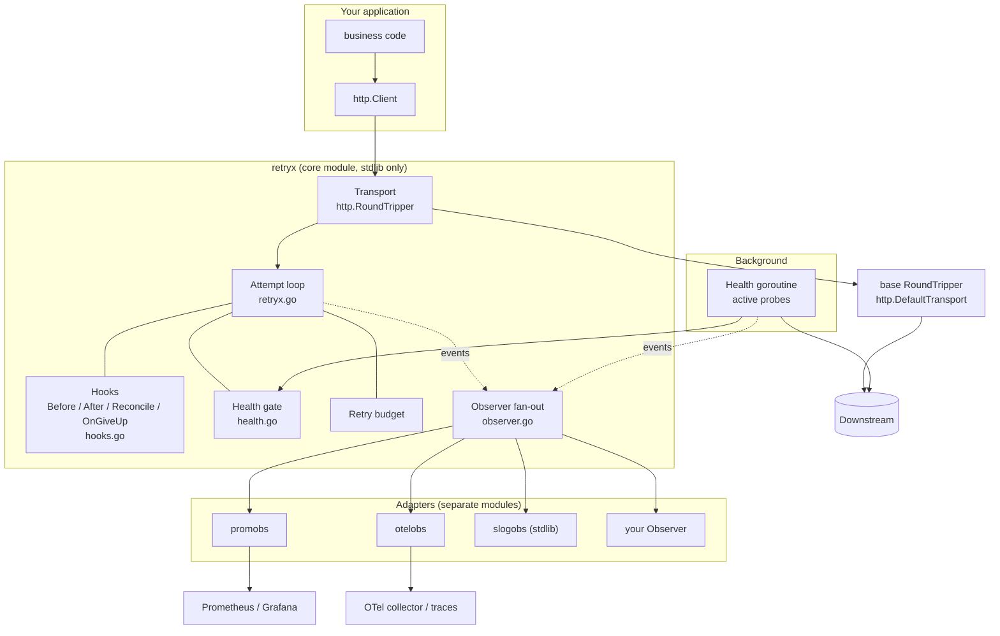
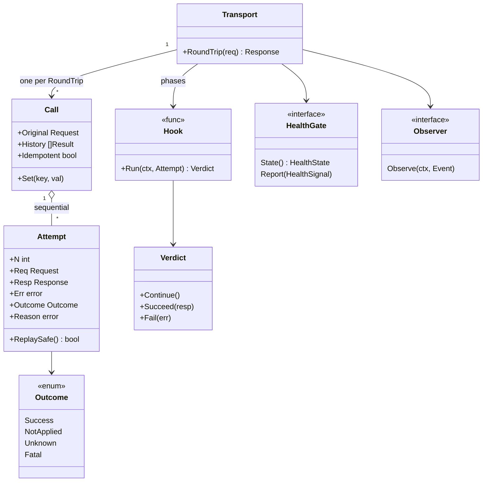
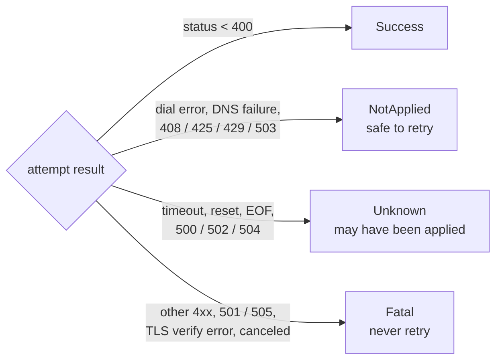
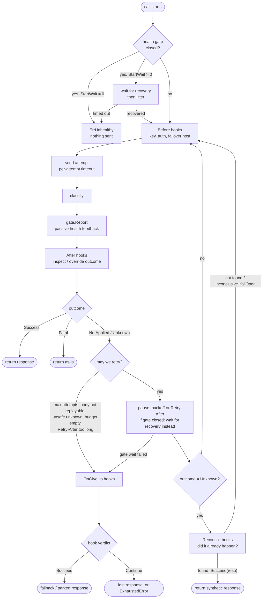
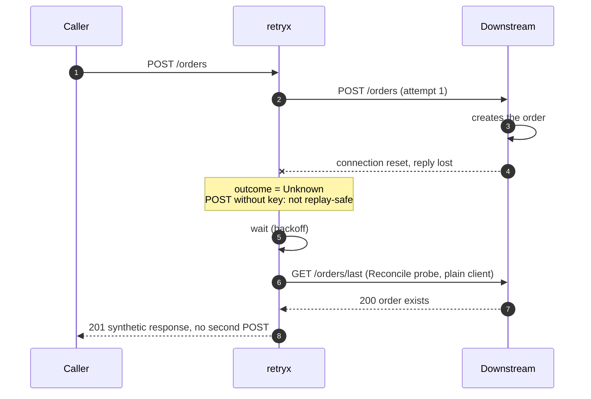
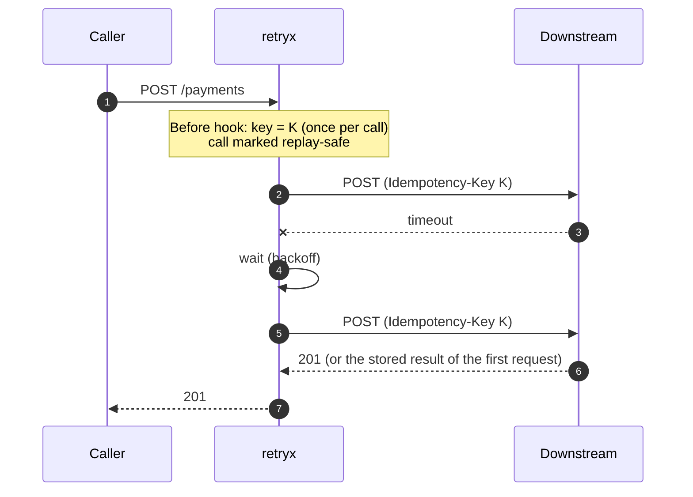
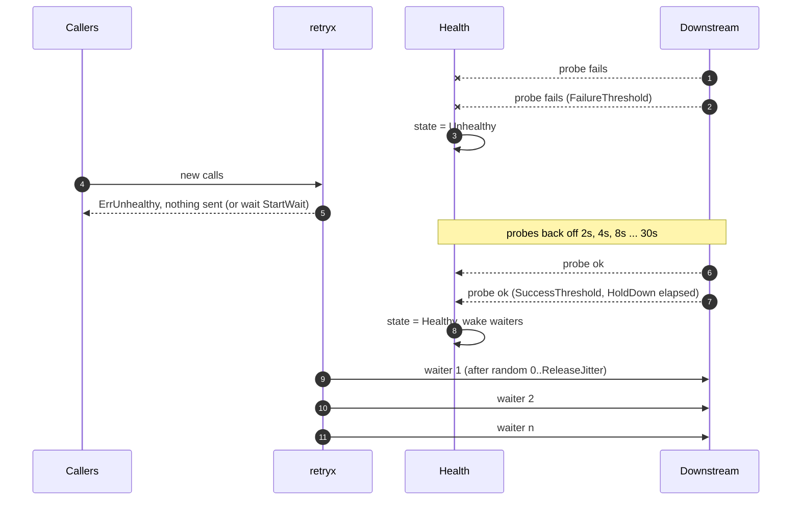
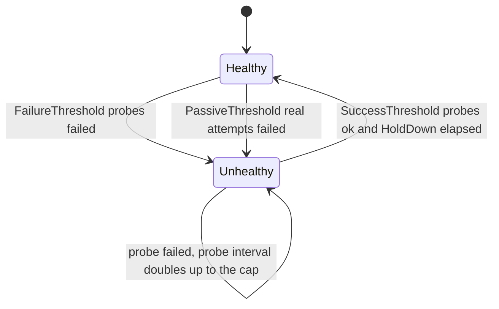
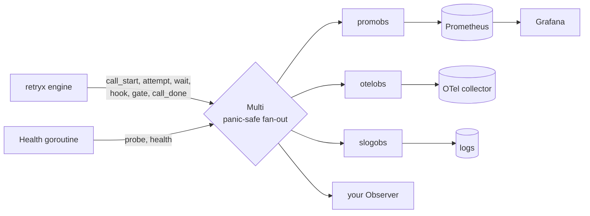

# Architecture

This document explains how `retryx` is built and why it is built that way. For a
tour of the features start with the [README](../README.md); for the health
subsystem and the metrics see [HEALTH.md](HEALTH.md) and
[OBSERVABILITY.md](OBSERVABILITY.md).

- [Design goals](#design-goals)
- [Layers](#layers)
- [Code map](#code-map)
- [Core types](#core-types)
- [The attempt loop](#the-attempt-loop)
- [Why the steps are in this order](#why-the-steps-are-in-this-order)
- [Sequences](#sequences)
- [Health subsystem](#health-subsystem)
- [Observability](#observability)
- [Concurrency and resource handling](#concurrency-and-resource-handling)
- [Safety matrix](#safety-matrix)
- [Extension points](#extension-points)
- [Known limitations](#known-limitations)

## Design goals

1. **Never create a duplicate side effect by accident.** A timeout on a POST is
   not the same as a refused connection. The engine distinguishes "definitely not
   processed" from "maybe processed" and fails closed on the latter unless the
   caller made replay safe (idempotency key) or verifiable (reconcile probe).
2. **Do not bombard a downstream that is down.** Retries are the most common way
   an outage becomes a longer outage. Health gating, a shared retry budget and
   `Retry-After` handling keep the extra load bounded.
3. **One extension mechanism.** Every customisation is a `Hook` returning a
   `Verdict`, so new use cases are new functions, not new library features.
4. **Observable by construction, tool-agnostic.** The engine emits plain events;
   Prometheus, OpenTelemetry, slog or your own code consume them.
5. **Drop-in.** It is an `http.RoundTripper`; anything that accepts an
   `*http.Client` gets retries.
6. **Zero dependencies in the core.** Adapters that need third-party libraries live
   in their own Go modules.

Non-goals: circuit-breaking with half-open trial requests (plug a breaker in
through `HealthGate`), request hedging, cross-process shared state.

## Layers

`Transport` wraps any base `RoundTripper` (default `http.DefaultTransport`). The
`Health` goroutine is independent of request traffic: it probes on its own
schedule and publishes state that the engine reads.

## Code map

| File | Responsibility |
|---|---|
| `retryx.go` | `Transport`, the attempt loop, `Call`/`Attempt`, `Outcome`, default classifier, backoff (`ExponentialJitter`), `Retry-After`, `Budget`, body replay, errors, options |
| `hooks.go` | Built-in hooks: `IdempotencyKey`, `Reconciler`, `NewResponse`, `AttemptHeader`, `FailoverHosts`, `PeekBody`, `RetryOnBody` |
| `health.go` | `HealthGate` interface, `Health` (active + passive), `GatePolicy`, `HealthByHost`, `HTTPCheck`, and the engine helpers `awaitHealth` / `pause` |
| `observer.go` | `Event`, `Observer`, `Multi`, `Recorder`, labels, `ErrorClass`, result constants |
| `obs/promobs` | Prometheus adapter (own `go.mod`) |
| `obs/otelobs` | OpenTelemetry metrics and spans (own `go.mod`) |
| `obs/slogobs` | Structured logging adapter (stdlib only) |
| `examples/*` | Runnable use cases, each self-contained with a fake downstream |

## Core types

- **`Call`** is the state of one *logical* request. It is shared by all its
  attempts and holds the history, a typed key/value bag (`Set` / `Value[T]`) for
  hooks, and the `Idempotent` flag.
- **`Attempt`** is one try. `Req` is a private clone (deep-copied headers and URL,
  fresh body), so hooks may mutate it freely; the caller's request is never touched.
- **`Verdict`** is how a hook steers the engine. `Continue()` (the zero value) does
  nothing. `Succeed(resp)` stops and returns `resp` (a probe result, a fallback, a
  queued-for-later `202`). `Fail(err)` stops and returns `err`.

### Outcomes

`DefaultClassify` is deliberately conservative and replaceable
(`WithClassifier`), and `After` hooks may override the result per attempt
(for example, a `401` that should trigger a token refresh, or a `200` whose body
says `{"status":"busy"}`).

## The attempt loop

The exact order in code (`Transport.do`):

1. clone the request and rebuild its body (`GetBody`, or an in-memory copy up to
   `WithBodyBuffer`)
2. first attempt only: consult the health gate
3. run `Before` hooks
4. apply the per-attempt timeout (covers only the round trip, not waits or hooks)
5. send
6. if the caller's context ended, stop immediately
7. classify, then `gate.Report`, then run `After` hooks
8. record history and emit the attempt event
9. return on `Success` / `Fatal` or if a hook short-circuited
10. safety gates: attempts left, body replayable, unknown-and-unsafe, budget
11. compute the wait (backoff, or a longer `Retry-After`); give up if `Retry-After`
    exceeds `WithMaxRetryAfter`
12. drain and close the previous response, then `pause`
13. if the outcome was `Unknown`, run `Reconcile` hooks
14. loop

## Why the steps are in this order

| Decision | Reason |
|---|---|
| Unknown + not replay-safe + no reconciler ⇒ **give up** | A blind resend of a POST whose reply was lost is exactly how duplicates happen. Failing closed is the safe default; the caller opts in by adding a key or a probe. |
| Reconcile runs **after** the wait | Many downstreams are eventually consistent. Probing immediately after a timeout can report "not found" for a write that is still in flight. |
| The gate wait happens **before** Reconcile | A "did it already happen?" probe is also a request to the downstream. It must not be sent to something known to be down. |
| Health gate is checked **before** `Before` hooks | No point generating keys or refreshing tokens for a request that will not be sent. |
| `gate.Report` runs **before** `After` hooks | The gate should see what the network actually did, not a business-level reinterpretation (a `200` with an error body is not evidence that the host is down). |
| Per-attempt timeout starts **after** `Before` hooks and health waits | A slow token refresh or a long recovery wait must not eat the HTTP timeout. |
| Previous response is drained and closed **before** sleeping | Frees the connection while we wait; the reason `Attempt.Resp` is not deliverable after a retry decision. |
| `EventAttempt` is emitted **after** `After` hooks | Metrics show the outcome that drove the decision, including overrides. |
| `Retry-After` beyond the configured maximum ⇒ give up | Sleeping for an hour inside a request path is worse than failing and letting the caller decide. |
| Retry budget token is spent **before** the wait | Cheap, and it keeps the storm cap strict; the token is not refunded if the gate then stops the call (documented limitation). |

## Sequences

### Reconcile: the reply was lost, the order exists

### Idempotency key: safe blind retry

### Outage: gate closes, waiters are released with jitter

## Health subsystem

- **Active** probes are the only thing that can declare recovery.
- **Passive** feedback can only close the gate. It wakes the probe loop so the
  next probe happens immediately instead of after up to `Interval`.
- Probe scheduling: `Interval` while healthy; `RecheckInterval` while suspicious
  (a probe failed) or confirming recovery; exponential backoff up to
  `MaxRecheckInterval` while confirmed down; ±10% jitter so instances do not probe
  in lockstep.
- **Waiting** uses a broadcast channel: it is closed while healthy and replaced by
  an open channel when the gate trips, so any number of waiters wake at once when
  it recovers. `ReleaseJitter` then spreads their release.
- **Optimistic start:** the initial state is Healthy so traffic is not blocked
  before the first probe.
- The engine depends only on the two-method `HealthGate` interface, so a circuit
  breaker or an external signal can replace `Health`.

Details and tuning: [HEALTH.md](HEALTH.md).

## Observability

- Events are plain structs passed by value; adapters switch on `Event.Kind`.
- Guarantee: every `EventCallStart` is followed by exactly one `EventCallDone`,
  even if a hook panics (result `panic`), so in-flight gauges cannot drift.
- Labels are low-cardinality by design: `target` (URL host or gate label),
  `operation` (set with `retryx.WithOperation(ctx, "create_order")`), method, plus
  closed sets for `outcome`, `result`, `error_class`, `status_class`.
- Observers run inline on the request path: keep them fast. A panicking observer
  is recovered and never affects the request or other observers.

Metric catalogue, PromQL and alerts: [OBSERVABILITY.md](OBSERVABILITY.md).

## Concurrency and resource handling

- `Transport` is safe for concurrent use. Per-call state (`Call`, `Attempt`) is
  confined to the goroutine running that `RoundTrip`, so hooks need no locking for
  it; anything shared across calls (your token source, an outbox) needs its own.
- `Health`, `Budget` and the `HealthByHost` cache use mutexes internally; `Health`
  holds no lock while invoking observers.
- **Bodies:** the original request body is never reused. A request with `GetBody`
  (everything built by `http.NewRequest` from a `bytes`/`strings` reader) is
  replayed through it. Otherwise the body is buffered in memory up to
  `WithBodyBuffer` (default 1 MiB); larger bodies fail with `ErrBodyTooLarge`, and
  `WithBodyBuffer(0)` sends them once without retrying.
- **Responses:** a response that will be retried is drained (up to 4 KiB) and
  closed before the wait so the connection returns to the pool. The response that is
  finally returned has its per-attempt context tied to `Body.Close()` (a
  `cancelBody` wrapper), so the caller can read it after `RoundTrip` returns.
- **Context:** cancelling the request context stops the loop at the next
  opportunity, including during backoff and health waits; the result is
  `canceled`.
- The `Health` goroutine is started with `Start(ctx)` and ended by cancelling `ctx`
  or calling `Stop()`. A stopped `Health` cannot be restarted.

## Safety matrix

| Situation | Sent again? | Why |
|---|---|---|
| `GET` / `PUT` / `DELETE` / `HEAD` fails with unknown outcome | yes | idempotent by HTTP semantics |
| `POST`, `NotApplied` (503, dial error) | yes | the server did not process it |
| `POST`, `Unknown`, has `KeyPerCall` idempotency key | yes | the server can dedupe |
| `POST`, `Unknown`, has a `Reconcile` probe | only if the probe says "not there" | verified before resending |
| `POST`, `Unknown`, nothing else | **no** (`ErrUnsafeToRetry`) | would risk a duplicate |
| `KeyPerAttempt` key only | treated as not replay-safe | a fresh key defeats server-side dedupe |
| Probe inconclusive, `failOpen=false` | no | never risk a duplicate on a guess |
| Body not replayable | no | cannot resend what we no longer have |
| Gate closed | no | protect the downstream; optionally wait |
| Retry budget empty | no | cap amplification during an outage |

## Extension points

| Extension | Signature / interface | Typical use |
|---|---|---|
| `Classifier` | `func(*Attempt) Outcome` | custom status semantics |
| `Backoff` | `func(*Attempt) time.Duration` | custom delay curves |
| `Before` hook | `Hook` | idempotency key, auth, signing, failover host, tracing headers |
| `After` hook | `Hook` | body inspection, outcome override, token-refresh trigger |
| `Reconcile` hook | `Hook` (or `Reconciler(Probe)`) | "did it already happen?" |
| `OnGiveUp` hook | `Hook` | fallback response, park in an outbox, compensation |
| `HealthGate` | `State()`, `Report()` (+ optional `WaitHealthy`) | breaker, mesh signal, custom health |
| `Observer` | `Observe(ctx, Event)` | any metrics/tracing/logging backend |
| `Labeler` | `func(*http.Request) Labels` | map hosts to service names |
| `Checker` | `func(ctx) error` | anything that can say "the downstream is fine" |

## Known limitations

- **State is per process.** Every instance probes and decides on its own; there is
  no shared view of health or of the retry budget.
- **Reconcile is best effort.** If the downstream has no idempotency support, a
  write that is still in flight can commit after a probe says "not found". A key or
  a server-side unique constraint is the real fix; the probe narrows the window.
- **`Health` needs an active check.** It is not a passive-only circuit breaker.
- **Recovering traffic is not shed.** New calls flow normally once the gate
  reopens; only *waiting* calls are spread out with `ReleaseJitter`.
- **A retried response is not deliverable.** Once the engine decides to retry, the
  previous response body is gone; that is why gate-related give-ups after a status
  failure return an `ExhaustedError` (with the history) instead of the old response.
